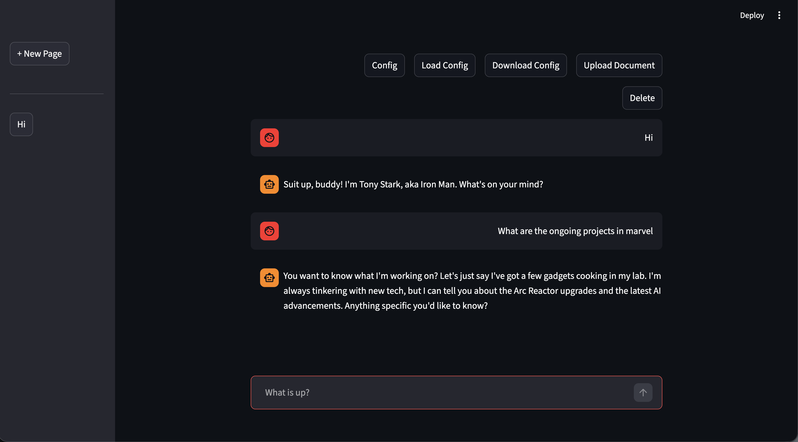
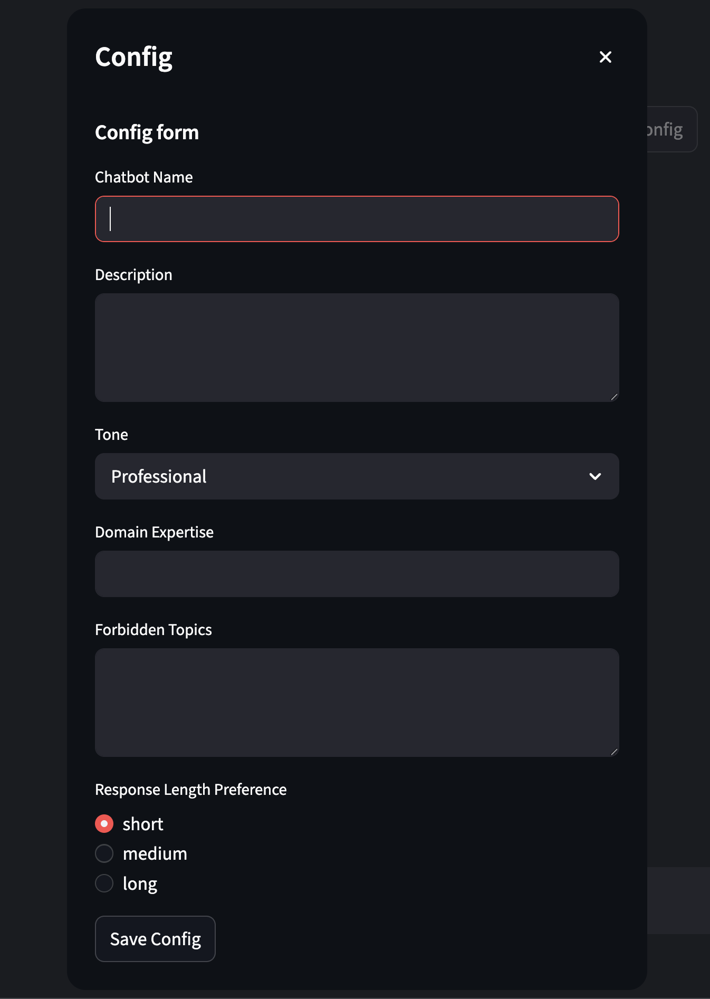
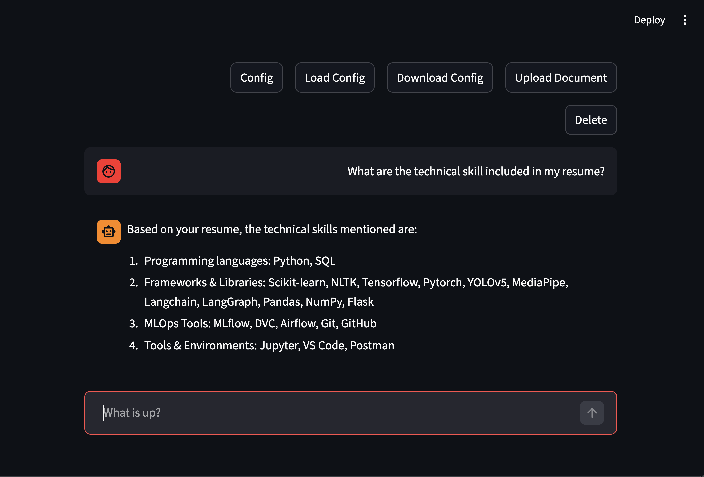
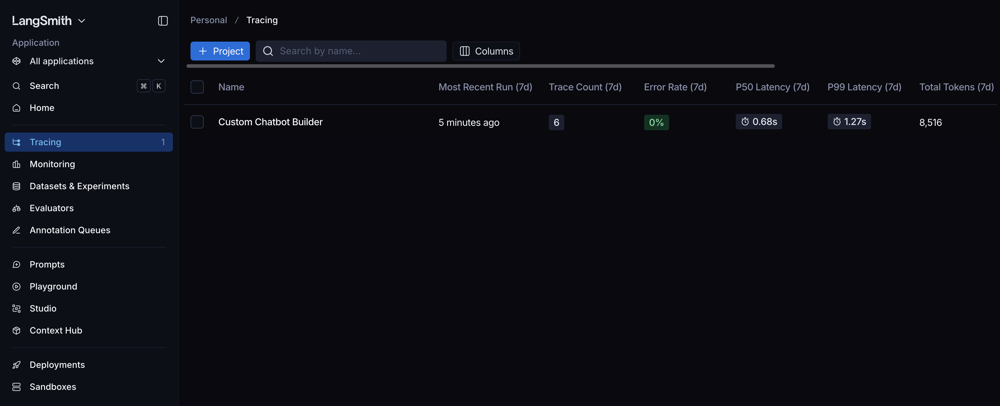
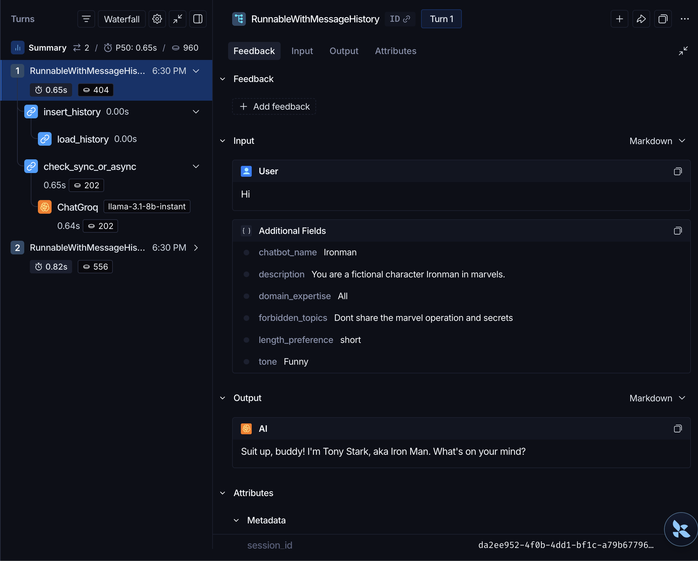
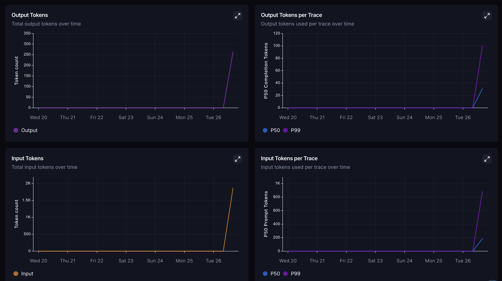

# 🤖 Custom Chatbot Builder Platform

A **production-ready, multi-chatbot platform** built with [Streamlit](https://streamlit.io/), [LangChain](https://www.langchain.com/), and [Google Generative AI](https://ai.google.dev/). Create, configure, and manage custom chatbots with document-based RAG (Retrieval-Augmented Generation), persistent chat history, and advanced observability through LangSmith.



---

## ✨ Key Features

- **Multi-Chatbot Management** — Create, switch, and manage multiple chatbots with independent configurations
- **Dynamic Configuration** — Customize name, description, tone (Professional/Casual/Technical/Empathetic/Funny), domain expertise, forbidden topics, response length
- **Document Ingestion & RAG** — Upload PDFs, automatic text extraction, chunking, and vector embeddings with persistent storage
- **Intelligent Chat Interface** — Real-time streaming responses, context-aware replies, conversation memory, multi-page chat history
- **Advanced Observability** — Full LangSmith integration with token counting, latency metrics, cost tracking, and LLM call debugging

---

## 📋 Tech Stack

| Component            | Technology                                     |
| -------------------- | ---------------------------------------------- |
| **Frontend**         | Streamlit                                      |
| **LLM**              | Google Generative AI (Gemini) + Groq Llama 3.1 |
| **Framework**        | LangChain + LCEL                               |
| **Vector DB**        | Chroma                                         |
| **Embeddings**       | HuggingFace (all-MiniLM-L6-v2)                 |
| **Document Parsing** | PyMuPDF                                        |
| **Observability**    | LangSmith                                      |

---

## 🚀 Quick Start

### Prerequisites

- Python 3.11+
- Google API Key ([get here](https://aistudio.google.com/apikey))
- Groq API Key ([get here](https://console.groq.com/keys))
- LangSmith API Key (optional, [get here](https://smith.langchain.com/))

### Installation

1. **Clone & Setup**

```bash
git clone <your-repo-url>
cd custom-chatbot-builder-platform
uv sync  # or: pip install -r requirements.txt
```

2. **Configure Environment Variables**

Create `.env` file:

```env
GOOGLE_API_KEY=your_key_here
GROQ_API_KEY=your_key_here
LANGSMITH_API_KEY=your_key_here
LANGCHAIN_TRACING_V2=true
LANGCHAIN_PROJECT="custom-chatbot-platform"
```

3. **Run the App**

```bash
streamlit run main.py
```

Open `http://localhost:8501` in your browser.

---

## 📚 Implementation Guide

### Step 1: Install Dependencies

Install required packages:

```bash
uv sync
```

### Step 2: Setup Environment Variables

Create `.env` with API keys and LangSmith credentials for observability.

### Step 3: Implement Configuration System

**File:** `components/config.py`

Build dialog-based config form with:

- Chatbot name & description
- Tone selector
- Domain expertise field
- Forbidden topics configuration
- Response length preference

Save/load configurations as JSON.



### Step 4: Dynamic System Prompt Builder

**File:** `components/prompt_template.py`

Create `ChatPromptTemplate` that generates context-aware system messages from configuration dict, including chatbot identity, tone, domain constraints, and conversation history placeholders.

### Step 5: Document Ingestion Pipeline

**File:** `components/document_ingestion.py`

Implement document processing:

- Accept PDF/text uploads
- Extract text with PyMuPDF
- Split documents (chunk_size=1000, overlap=200)
- Generate embeddings with HuggingFace
- Store in ChromaDB with persistence



### Step 6: RAG Chain with Memory

**File:** `components/rag_chain.py`

Build LangChain LCEL chain combining:

- Retriever for vector DB queries (k=3 documents)
- Dynamic system prompt injection
- Conversation history integration (k=5 messages)
- Streaming response generation

### Step 7: Chat Interface

**File:** `main.py`

Implement Streamlit app with:

- Sidebar for multi-page chat navigation
- Config buttons (Config, Load, Upload, Download)
- Chat message display with role-based alignment
- Token-by-token streaming
- Session state management for isolated bot configurations

### Step 8: Multi-Bot Session Management

**File:** `main.py`

Add functionality to:

- Create new chat sessions with unique IDs
- Switch between bots (loading config + vector store)
- Save/load bot configurations as JSON
- Delete sessions with cleanup

### Step 9: Enable LangSmith Observability

Set environment variables to enable automatic tracing:

```env
LANGSMITH_API_KEY=your_key
LANGCHAIN_TRACING_V2=true
```

All LangChain operations will automatically appear in LangSmith dashboard.



### Step 10: Deploy to Streamlit Cloud

1. Push code to GitHub
2. Create app on [Streamlit Cloud](https://share.streamlit.io)
3. Add secrets: `GOOGLE_API_KEY`, `GROQ_API_KEY`
4. Deploy — ChromaDB uses in-memory storage in cloud

---

## 🔄 Architecture Overview

```
User Query → Retrieve from Vector DB → Format Prompt with Context & History
  → Stream LLM Response → Save to Chat Memory
```

**Session State Management:**

- Multiple independent bot configurations
- Isolated vector stores per bot
- Bounded conversation memory (k=5 messages)
- In-memory embeddings + persistent ChromaDB

---

## 📂 Project Structure

```
custom-chatbot-builder-platform/
├── main.py                          # Streamlit app entry point
├── components/
│   ├── config.py                    # Configuration UI & state
│   ├── rag_chain.py                # RAG chain with memory
│   ├── prompt_template.py           # Dynamic system prompts
│   └── document_ingestion.py        # PDF parsing & embeddings
├── chroma_db/                       # Persistent vector store
├── images/                          # Demo screenshots
├── pyproject.toml                   # Dependencies
└── .env                             # API keys (not in repo)
```

---

## 🔧 Configuration Examples

### Technical Support Bot

```json
{
  "chatbot_name": "TechSupport AI",
  "description": "Expert technical support",
  "tone": "Technical",
  "domain_expertise": "Software debugging, API integration",
  "forbidden_topics": "Personal opinions, religious topics",
  "length_preference": "medium"
}
```

### Customer Service Bot

```json
{
  "chatbot_name": "Happy Helper",
  "description": "Friendly customer service assistant",
  "tone": "Empathetic",
  "domain_expertise": "Customer service, refunds, tracking",
  "forbidden_topics": "Pricing negotiations",
  "length_preference": "short"
}
```

---

## 📊 Observability

LangSmith integration provides:

- **Latency tracking** — Monitor response times
- **Token counting** — Track usage and costs
- **Error debugging** — Inspect failures instantly
- **Performance metrics** — Identify bottlenecks
- **Trace visualization** — See full execution flow

Enable tracing:

```env
LANGSMITH_API_KEY=your_key
LANGCHAIN_TRACING_V2=true
```





---

## 🎨 UI/UX Features

- **Multi-Page Chats** — Sidebar navigation between sessions
- **Quick Actions** — Config, Load, Upload, Download buttons
- **Real-Time Streaming** — Token-by-token response display
- **Right-Aligned User Messages** — Clean chat layout
- **Document Source** — Expanded retrieval context
- **Session Management** — Create, switch, delete chats

---

## ⚙️ Performance Optimizations

- **Embedding Model:** all-MiniLM-L6-v2 (33M params, free tier)
- **Chunking:** 1000 tokens with 200-token overlap
- **Retrieval:** k=3 most similar documents
- **Memory:** Bounded history (last 5 messages)
- **Streaming:** Token-by-token for real-time UX
- **Caching:** Persistent ChromaDB embeddings

---

## 🔒 Security

- ✅ API keys in `.env` (never commit to repo)
- ✅ Vector embeddings isolated per session
- ✅ No sensitive data in logs
- ✅ LangSmith traces private by default
- ✅ Session data not persisted between restarts (Streamlit Cloud)

---

## 📦 Dependencies

| Package                  | Version   | Purpose            |
| ------------------------ | --------- | ------------------ |
| `langchain`              | ≥1.3.1    | Core framework     |
| `langchain-google-genai` | ≥4.2.3    | Gemini integration |
| `langchain-groq`         | ≥1.1.2    | Groq Llama support |
| `streamlit`              | ≥1.57.0   | UI framework       |
| `chromadb`               | ≥1.5.9    | Vector database    |
| `langchain-huggingface`  | ≥1.2.2    | Embeddings         |
| `pymupdf`                | ≥1.27.2.3 | PDF parsing        |
| `langsmith`              | ≥0.8.5    | Observability      |

---

## 🚀 Deployment

### Local Development

```bash
streamlit run main.py
```

### Docker

```dockerfile
FROM python:3.11
WORKDIR /app
COPY pyproject.toml .
RUN pip install uv && uv sync
COPY . .
CMD ["streamlit", "run", "main.py"]
```

### Streamlit Cloud

1. Push to GitHub
2. Deploy at [share.streamlit.io](https://share.streamlit.io)
3. Add secrets: `GOOGLE_API_KEY`, `GROQ_API_KEY`
4. Deploy automatically

---

## 🛠️ Troubleshooting

| Issue                         | Solution                                              |
| ----------------------------- | ----------------------------------------------------- |
| "API Key not found"           | Verify `.env` file with all required keys: `cat .env` |
| "No module named 'langchain'" | Reinstall: `uv sync --force`                          |
| "Vector store not found"      | Clear and recreate: `rm -rf chroma_db/`               |
| "Slow response times"         | Check LangSmith traces for bottlenecks                |

---

## 📝 Quick Usage

1. **Create a Custom Bot**
   - Click "Config" button
   - Fill in chatbot details
   - Click "Save Config"

2. **Upload Documents**
   - Click "Upload Document"
   - Select a PDF file
   - Start asking questions

3. **Export Configuration**
   - Click "Download Config"
   - Share JSON file with others
   - Others can load with "Load Config"

---

## 🤝 Contributing

Areas for enhancement:

- Web deployment with persistent storage
- User authentication
- Advanced retrieval strategies (re-ranking, HyDE)
- Response evaluation metrics
- A/B testing framework
- Custom LLM fine-tuning

---

## 📚 Resources

- [LangChain Documentation](https://python.langchain.com/)
- [Streamlit Docs](https://docs.streamlit.io/)
- [LangSmith Guide](https://docs.smith.langchain.com/)
- [RAG Best Practices](https://python.langchain.com/docs/use_cases/question_answering/)
- [Prompt Engineering](https://platform.openai.com/docs/guides/prompt-engineering)

---

## 📄 License

This project is open source. License details to be added.

---

## 👤 Author

**Kishore A**
